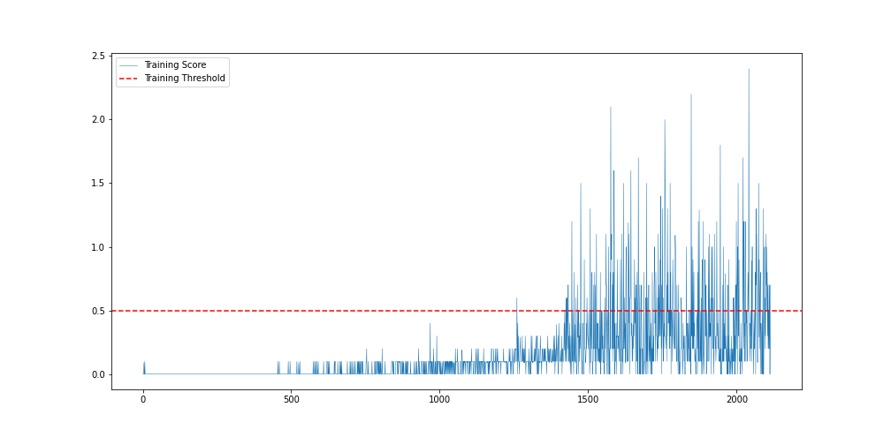

[//]: # "Image References"
[image1]: https://user-images.githubusercontent.com/10624937/42135623-e770e354-7d12-11e8-998d-29fc74429ca2.gif "Trained Agent"
[image2]: https://user-images.githubusercontent.com/10624937/42135622-e55fb586-7d12-11e8-8a54-3c31da15a90a.gif "Soccer"

# Learning Algorithm

The methodology used to solve this problem is an actor-critic method called Deep Deterministic Policy Gradient (DDPG) and it was first implemented in [this](https://arxiv.org/abs/1509.02971) paper.

There are two agents (the tennis players) and they share a Replay Buffer under a **Multi-Agent** class. States for both agents are saved in the environment, and based on them the two agents take individual actions. The code for the Actor Critic model is heavily based on the previous assignment for the double jointed arm. In brief we could summarize the MultiAgent DDPG extension, as an algorithm where the training happens in a centralized way and the execution is decentralized.

- **Critic:** The Critic model computes the Q values for any given state/action pair using the Bellman Equation. Each agent receives states and actions both for itself and the other agent, so that information is shared between the agents.

- **Actor:** Current policy is estimated by mapping states to actions in a deterministic way. We then update the actor parameters by performing gradient ascent on the policy. In constrast to the critic model each agent only has information of its own states and actions.

- **Replay Buffer:** The exploration policy is used to sample transitions from the environment and the combination of states, actions and rewards is stored in the replay buffer. The old samples are discarded when the replay buffer becomes full. A minibatch is sampled uniformly from the buffer at each time step in order to update the critic and the actor. The **buffer size** that we use is **10,0000** and the **minibatch size 128**.

- **Soft Update:** DDPG uses soft target updates instead of directly copying the weights. The weights of the target networks (actor and critic) are gradually updated, which improves the stability of learning. The **tau** parameter that is used for the soft update is **0.001**.

- **Hyperparameters:** We use the same learning rates for the actor and critic (**0.0001**) networks. We set the **L2 weight decay** to **0.000001** and the **discount factor gamma** to 0.99. The optimizer is an Adam optimizer

- **Networks:** The final output layer of the actor network is a _tanh_ layer, that is necessary to bound the actions. The low-dimensional networks had 2 hidden layers with **256** and **256** units respectively. The final layer weights and biases for the two networks were initialized from a uniform distribution **[-0.003, 0.003]**. This ensures that the initial outputs for the policy and value estimates are near zero. A **ReLU** activation is used for the fully connected layers of the two networks. The full architectures of the neural networks (both agents have the same architecture for their actor and critic networks) are:

  - Actor: Linear(24, 256) - ReLU - BatchNorm - Linear(256, 256) - ReLU - Linear(256, 2)
  - Critic: Linear(24, 256) - ReLU - BatchNorm - Linear(256+2, 256) - ReLU - Linear(256, 2)

- **Noise:** We add temporally correlated noise to encourage explanatory behaviour in the agent. In particular we used the Ornstein-Uhlenbenk process that models the velocity of a Brownian particle with friction. The parameters for this process are: **theta = 0.15** and **sigma = 0.2**

# Results

The environment was solved after 2115 episodes with an average score of 0.5 over 100 episode windows.

![alt text for screen readers][image1]

The x-axis in this graph shows the incremental number of episodes. The y-axis shows the the average score for the last 100 episodes. As you can see in the graph below, there was a lot of fluctuation in the average scores of the agents, and this is mainly caused by the multi-agent nature of the algorithm.A significant pick up is observed after 1500 episodes, while after that point the increase was more gradual.

## Future work

For future work I would test different specifications for the hidden layers as well as hyperparameter optimisation to see if the agents reach faster to the target score. For example, I would try to replace random sampling with Prioritized Replay for the Replay Buffer. Also it would be interesting to try various weight initializations and evaluate the difference in the results.

Most importantly, further research in a) Neural Networks (training directly from pixels of the environment with CNNs) and b) RL algorithms for multiagent settings (e.g. PPO or D4PG) is needed, in order to get a faster and less fluctuating learning curve.
